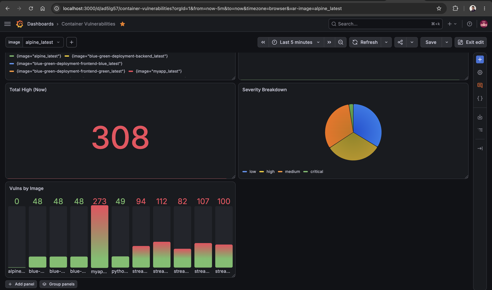
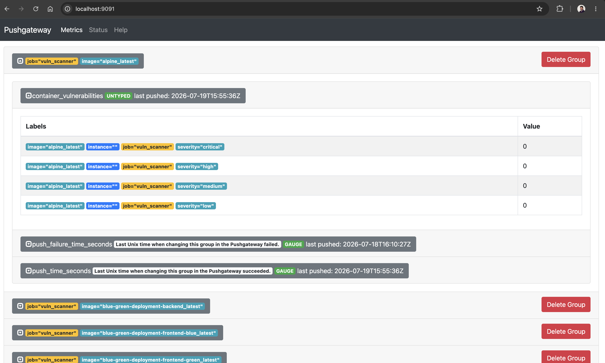
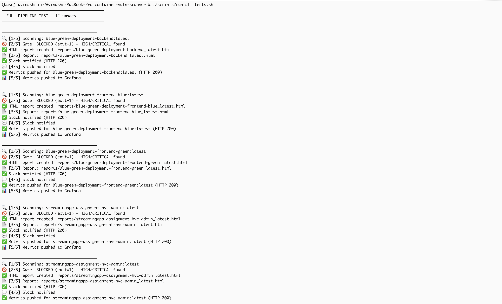

# 🛡️ Container Image Vulnerability Scanner with Reporting


An automated security tool that scans Docker container images for known vulnerabilities (CVEs), blocks insecure images in CI/CD pipelines, sends real-time Slack alerts, and tracks vulnerability trends on a Grafana dashboard.

> **Problem it solves:** DevOps teams often deploy container images without security checks, allowing known vulnerabilities to reach production. This tool ensures **only secure images are deployed** by integrating automated scanning directly into the build pipeline.




## Results at a Glance

- 🔴→🟢 **[Red build blocked, fixed via base upgrade, then green](docs/images/action-tab-red-green-build.png)** — the full DevSecOps cycle demonstrated in GitHub Actions
- 🚦 **[Jenkins Security Gate blocking a vulnerable image](docs/images/jinkins-security-gate-stage-red.png)** — push-triggered builds via GitHub webhook (ngrok tunnel)
- 📊 **[Live Grafana dashboard](docs/images/01-grafana-dashboard.png)** tracking 11 real images with per-image filters and trend lines
- 💬 **[Color-coded Slack alerts](docs/images/slack-messages.png)** on every scan
- 🧪 **[End-to-end test suite summary](docs/images/run_all_tests.png)** — PASS/FAIL verdict for every image

---

## Architecture

```
             ┌──────────────────────────────────────────────────────┐
             │                    Developer pushes code             │
             └───────────────────────────┬──────────────────────────┘
                                         ▼
                     ┌──────────────────────────────────┐
                     │  CI/CD (Jenkins / GitHub Actions)│
                     │  1. docker build                 │
                     │  2. trivy scan  ──── FAIL? ─────►│──► ❌ Build blocked
                     └───────────────┬──────────────────┘
                                     │ PASS
                 ┌───────────────────┼───────────────────────┐
                 ▼                   ▼                        ▼
        ┌───────────────┐   ┌───────────────┐        ┌──────────────┐
        │ HTML / JSON   │   │ Slack         │        │ Pushgateway  │
        │ Reports       │   │ Notifications │        │      ▼       │
        └───────────────┘   └───────────────┘        │ Prometheus   │
                                                     │      ▼       │
                                                     │  Grafana 📊  │
                                                     └──────────────┘
```

**Flow:** A developer pushes code → CI/CD builds the image → Trivy scans it → builds with fixable HIGH/CRITICAL findings are **blocked** → passing builds generate reports, fire a Slack alert, and push metrics to the Grafana dashboard. Jenkins builds are push-triggered through a GitHub webhook (ngrok tunnel); GitHub Actions triggers natively on push.

### Monitoring Data Flow — Why Pushgateway?

```
push_metrics.py ──PUSH──▶ Pushgateway ◀──PULL (every 15s)── Prometheus ◀──query── Grafana
 (runs & exits)           (holds data)                      (time-series DB)      (dashboard)
```

Prometheus works on a **pull model** — it visits long-running servers every 15 seconds to collect metrics. Our scan scripts, however, are **short-lived**: they run, push results, and exit. By the time Prometheus comes to pull, the script is already gone.

**Pushgateway solves this:** the scan script *pushes* metrics to Pushgateway (`localhost:9091`), which holds them until Prometheus pulls on its normal schedule. Each scanned image gets its own metric group, identified by the `image` label — this is also what powers the per-image filter dropdown in Grafana.

The Pushgateway UI (http://localhost:9091) doubles as a debugging checkpoint: if Grafana shows "No data", checking whether the metric exists here immediately tells you which half of the pipeline broke (script → Pushgateway, or Pushgateway → Prometheus → Grafana). Stale groups from removed images can be cleaned with **Delete Group**.

> **Known trade-off:** Pushgateway never expires metrics on its own — the last pushed value persists until manually deleted. This is acceptable for batch-style scan jobs (its intended use case), but is why Pushgateway isn't used for regular always-on services.



## Key Features

| Feature | Description |
|---|---|
| 🔍 Automated Scanning | Trivy-based CVE scanning of any Docker image |
| 🚦 Security Gate | Builds fail automatically on fixable HIGH/CRITICAL vulnerabilities |
| ⚡ Push-Triggered CI | GitHub Actions natively + Jenkins via GitHub webhook (ngrok) |
| ⚙️ Configurable Thresholds | Severity levels controlled via `configs/scanner-config.env` |
| 📄 Report Generation | Styled HTML + machine-readable JSON reports |
| 💬 Slack Notifications | Color-coded alerts (🔴 critical / 🟠 high / 🟢 clean) |
| 📊 Grafana Dashboard | Historical trends, per-image filters, severity breakdown |
| 🚫 Exception Management | `.trivyignore` for approved CVEs with expiry tracking |
| 🔁 Auto Rescanning | Change-detection rescans with alert-on-change only |
| ♻️ Retry Logic | Network failures retry; real vulnerabilities never do |

## Quick Start (3 commands)

```bash
git clone https://github.com/Avinashsain/container-vuln-scanner.git
cd container-vuln-scanner
./setup.sh
```

Then open:
- **Grafana dashboard:** http://localhost:3000 (admin / admin123)
- **Prometheus:** http://localhost:9090
- **Scan any image:** `./scripts/scan_image.sh <image-name>`

## Project Structure

```
container-vuln-scanner/
├── scripts/              # Scanning, reporting, metrics scripts
│   ├── scan_image.sh         # Single image scan with security gate
│   ├── scan_with_retry.sh    # Scan with smart retry logic
│   ├── parse_scan.py         # JSON report parser & summarizer
│   ├── generate_report.py    # HTML report generator
│   ├── push_metrics.py       # Grafana/Prometheus metrics pusher
│   ├── rescan.py             # Change-detection rescanner
│   ├── run_all_tests.sh      # End-to-end test suite (all images)
│   └── generate_trend_data.sh# Trend data generator for dashboard
├── notifications/
│   └── slack_notify.py       # Slack webhook alerting (non-blocking)
├── configs/
│   ├── scanner-config.env    # Severity thresholds & settings
│   ├── prometheus.yml        # Prometheus scrape config
│   └── exceptions.json       # Approved CVE exceptions with expiry
├── ci/
│   └── Jenkinsfile           # Jenkins pipeline (5 stages)
├── .github/workflows/
│   └── scan.yml              # GitHub Actions workflow
├── dashboards/
│   └── vuln-dashboard.json   # Exported Grafana dashboard
├── reports/                  # Generated scan reports (gitignored)
├── docs/                     # Full documentation
├── .trivyignore              # CVE exception list
├── docker-compose.yml        # Prometheus + Grafana + Pushgateway
├── Dockerfile                # Sample app image
└── setup.sh                  # One-command setup
```

## Tested With Real Projects

This scanner was validated against **11 real images**, including microservices from two other projects:

- ✅ Blue-Green Deployment project (backend + blue/green frontends) — integrated as a **pre-switch security check**: green environment only receives traffic after passing the security gate
- ✅ Streaming App (5 microservices: admin, auth, chat, frontend, streaming)
- ✅ Deliberately vulnerable image (`python:3.4-alpine`) to prove the gate blocks correctly



## Documentation

| Document | Contents |
|---|---|
| [docs/setup.md](docs/setup.md) | Installation for macOS/Linux/Windows |
| [docs/usage.md](docs/usage.md) | Scanning, reports, thresholds, exceptions |
| [docs/ci-cd.md](docs/ci-cd.md) | Jenkins & GitHub Actions integration (incl. webhook setup) |
| [docs/troubleshooting.md](docs/troubleshooting.md) | Real errors faced & their fixes |

## Cost Optimization

- **100% free & open-source stack** — Trivy, Prometheus, Grafana, Jenkins: zero license cost
- **Localhost development** — no cloud VM bills
- **GitHub Actions free tier** — unlimited minutes for public repos
- **CVE database caching** — ~500 MB DB cached locally (`~/.cache/trivy`), avoiding repeated downloads; Trivy binary also cached in GitHub Actions (saves CI minutes)
- **Severity filtering** — scanning/alerting only HIGH/CRITICAL reduces noise and storage
- **Change-based alerting** — notifications only when counts change → less alert fatigue
- **Non-blocking notifications** — Slack failures never waste a CI re-run

## Tech Stack

Trivy · Docker · Python 3 · Bash · Jenkins · GitHub Actions · Prometheus · Pushgateway · Grafana · Slack API · ngrok
