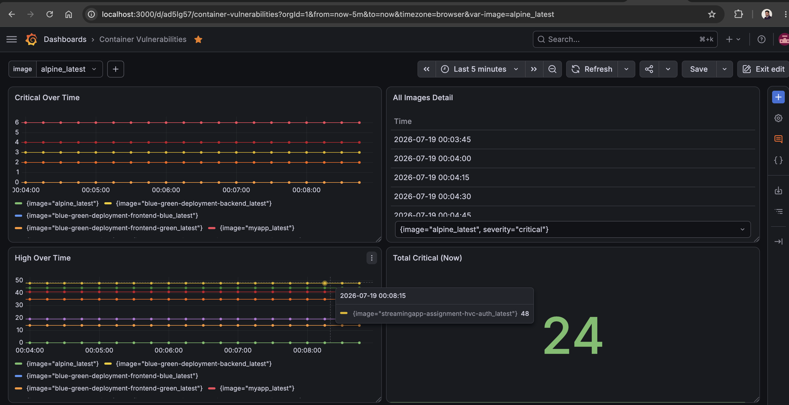

# 📸 Screenshot Checklist

Documentation mein 19 screenshot placeholders hain. Har screenshot kaise lena hai, uska exact tarika:

## README.md (2 screenshots)

| # | Screenshot | Kaise lena hai |
|---|---|---|
| 1 | Grafana dashboard full view | http://localhost:3000 → dashboard kholo → saare 7 panels dikhne chahiye. Pehle `./scripts/generate_trend_data.sh` chala lo taaki graphs bhare hue hon |
| 2 | run_all_tests.sh final summary | Terminal mein `./scripts/run_all_tests.sh` chalao → end mein FINAL SUMMARY (PASS/FAIL list) dikhe |
| 20 | Pushgateway UI | http://localhost:9091 kholo → image groups + `container_vulnerabilities` values (aap ye already le chuke ho! ✅) |

## docs/setup.md (4 screenshots)

| # | Screenshot | Kaise lena hai |
|---|---|---|
| 3 | hello-world output | `docker run hello-world` → "Hello from Docker!" message |
| 4 | docker compose ps | Project folder mein `docker compose ps` → grafana, prometheus, pushgateway teeno "Up" |
| 5 | Slack alert message | Slack channel kholo jahan alerts aate hain → koi 🔴/🟢 scan alert dikhe |
| 6 | setup.sh complete | `./setup.sh` chalao → "🎉 Setup complete!" wala pura output |

## docs/usage.md (5 screenshots)

| # | Screenshot | Kaise lena hai |
|---|---|---|
| 7 | FAIL scan output | `./scripts/scan_image.sh python:3.4-alpine` → vulnerability table + failure |
| 8 | PASS scan output | `./scripts/scan_image.sh alpine:latest` → "✅ Image passed the security gate!" |
| 9 | HTML report in browser | Koi bhi `reports/*.html` file browser mein kholo → badges + colored table |
| 10 | Image dropdown open | Grafana dashboard → top-left image dropdown click karke khula hua |
| 11 | Trend lines panel | Critical Over Time panel — multiple data points wali lines (trend data script ke baad) |

## docs/ci-cd.md (8 screenshots)

| # | Screenshot | Kaise lena hai |
|---|---|---|
| 12 | Actions history red+green | GitHub → Actions tab → dono builds (❌ purana, ✅ naya) ek saath list mein |
| 13 | Red build log | Red build kholo → Security gate step → "exit code 1" line |
| 14 | Green build all steps | Green build kholo → saare steps ✅ |
| 15 | Artifacts section | Kisi bhi run ke page par neeche Artifacts → vulnerability-report |
| 16 | Jenkins job config | Job → Configure → SCM section (Git URL + */main + ci/Jenkinsfile) |
| 17 | Jenkins Stage View red gate | Blocked build ka Stage View — Security Gate stage red |
| 18 | Jenkins Artifacts | Build page → scan-report.json + scan-report.html links |
| 19 | Jenkins Console Output | Console Output mein Trivy vulnerability table |

## Tips

- Screenshots lene ke baad `docs/images/` folder banao, wahan save karo (naam: `01-grafana-dashboard.png` style)
- Markdown mein placeholder ko replace karo:
  ```markdown
  
  ```
- Mac par screenshot: **Cmd+Shift+4** (area select) ya **Cmd+Shift+3** (full screen)
- Browser screenshots mein URL bar dikhna achha hai (localhost:3000 etc. proof ke liye)
- Terminal screenshots se pehle font size bada kar lo (Cmd + '+') — readable rahega

## Priority (agar time kam hai)

Sabse important 6, jo evaluation ke liye must-have hain:
1. #12 — Actions red+green (fail→fix→pass story)
2. #1 — Grafana full dashboard
3. #7 — FAIL scan (gate proof)
4. #17 — Jenkins red gate
5. #9 — HTML report
6. #5 — Slack alert
