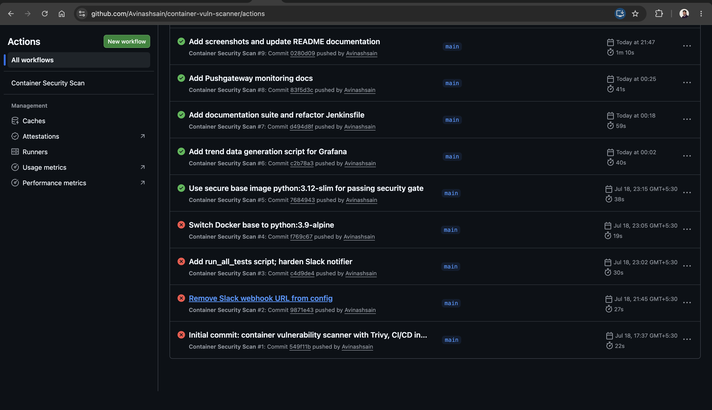
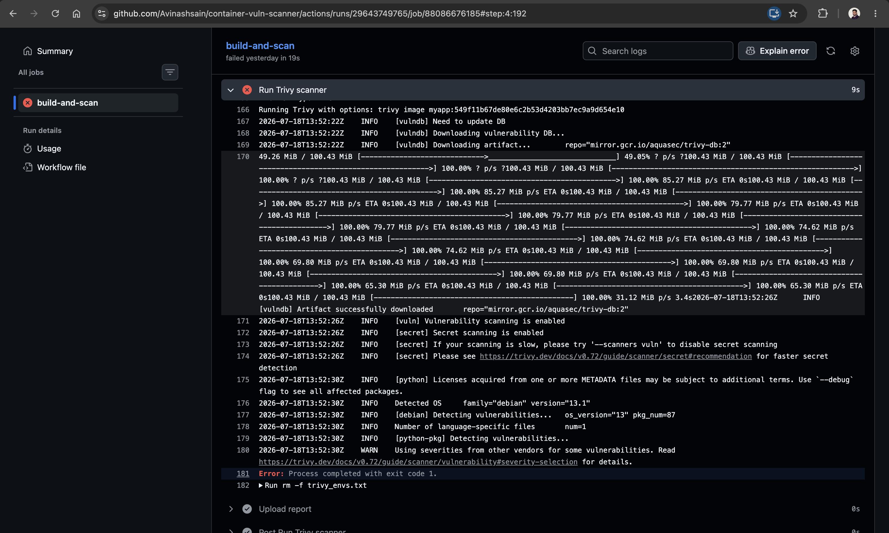
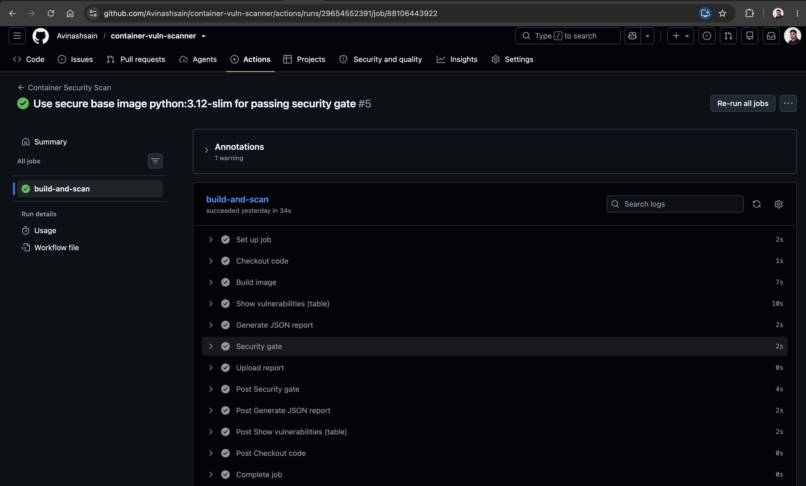
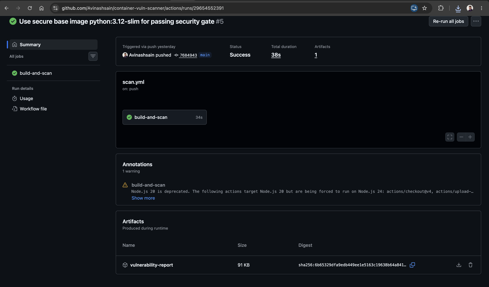
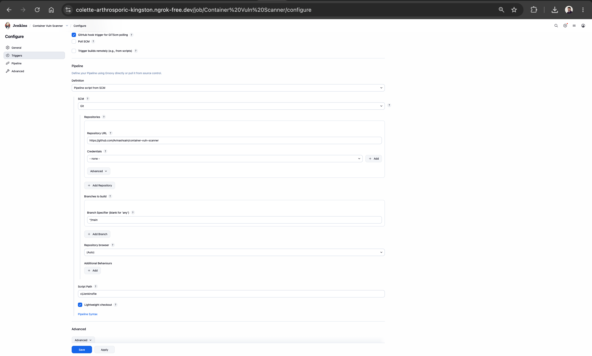
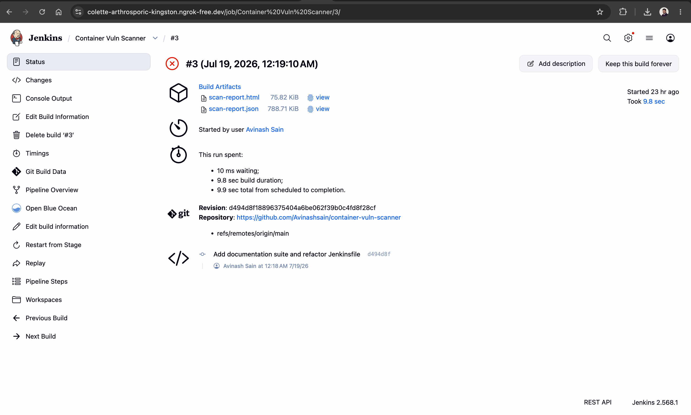
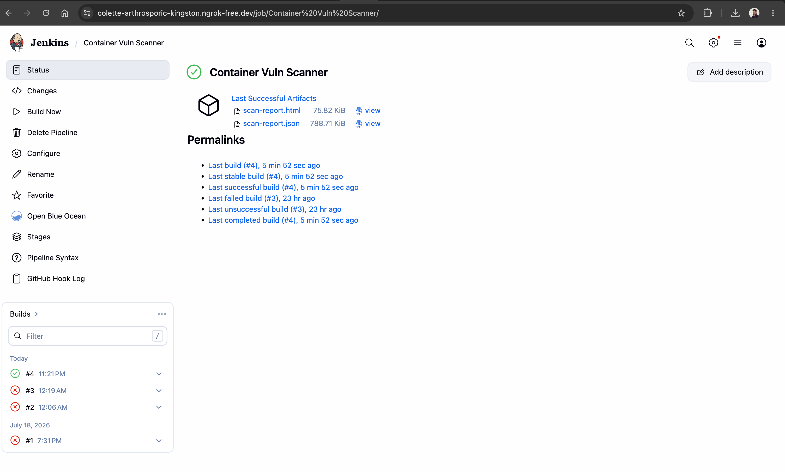
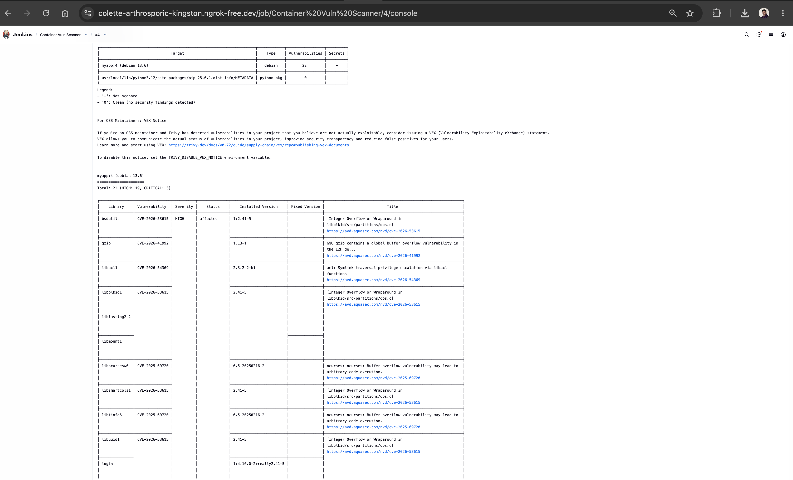

# CI/CD Integration Guide

The scanner is integrated with **two** CI/CD systems: GitHub Actions (cloud) and Jenkins (local native install). Both follow the same pattern:

```
Build image → Show vulnerabilities (never fails) → Save reports → SECURITY GATE (fails on HIGH/CRITICAL) → Deploy
```

**Why this stage order matters:** the "show" step uses `exit-code 0` so the vulnerability table is ALWAYS visible in logs, and reports are saved BEFORE the gate runs — so even a blocked build leaves full evidence for debugging.

---

## Part A: GitHub Actions

### Workflow file: `.github/workflows/scan.yml`

```yaml
name: Container Security Scan

on:
  push:
    branches: [ main ]
  pull_request:

jobs:
  build-and-scan:
    runs-on: ubuntu-latest
    steps:
      - name: Checkout code
        uses: actions/checkout@v4

      - name: Build image
        run: docker build -t myapp:${{ github.sha }} .

      # Step A: table in log (never fails)
      - name: Show vulnerabilities (table)
        uses: aquasecurity/trivy-action@master
        with:
          image-ref: myapp:${{ github.sha }}
          format: table
          exit-code: 0
          severity: HIGH,CRITICAL

      # Step B: JSON report
      - name: Generate JSON report
        uses: aquasecurity/trivy-action@master
        with:
          image-ref: myapp:${{ github.sha }}
          format: json
          output: scan-report.json
          exit-code: 0

      # Step C: SECURITY GATE
      - name: Security gate
        uses: aquasecurity/trivy-action@master
        with:
          image-ref: myapp:${{ github.sha }}
          exit-code: 1
          severity: HIGH,CRITICAL
          ignore-unfixed: true

      - name: Upload report
        if: always()          # report saved even when gate fails
        uses: actions/upload-artifact@v4
        with:
          name: vulnerability-report
          path: scan-report.json
```

### Trigger
Every `git push` to `main` (and every pull request) automatically runs the pipeline. View runs at: `github.com/<username>/container-vuln-scanner/actions`

### Demonstrated result: FAIL → FIX → PASS

We proved the complete DevSecOps cycle with two builds:

| Build | Base image | Result | Why |
|---|---|---|---|
| #1 | `python:3.9-slim` | ❌ RED — blocked | Debian base packages had HIGH/CRITICAL CVEs; gate exit code 1 |
| #2 | `python:3.12-slim` | ✅ GREEN — passed | Updated base eliminated fixable HIGH/CRITICAL findings |

**The fix was a one-line Dockerfile change** — this demonstrates the intended workflow: vulnerable image blocked → developer remediates (base upgrade) → gate passes → deployment proceeds.






### Cost optimization in Actions
- Trivy binary is **cached** between runs (`Cache restored successfully` in logs) — saves download time and CI minutes
- Public repo = unlimited free Actions minutes

---

## Part B: Jenkins (Native Install, localhost:8080)

### Prerequisites
- Jenkins LTS running natively (not Docker) at http://localhost:8080
- Plugins: **Pipeline** + **Git** (from suggested plugins) — optionally **HTML Publisher**
- Jenkins can execute `docker` and `trivy` (verified via a test Freestyle job)

> **macOS PATH note:** when Jenkins runs as a background service, its PATH excludes Homebrew and `/usr/local/bin` — so `docker`, `trivy`, and `python3` are "not found" even though they work in your terminal. Fixed by prepending them to PATH in the Jenkinsfile `environment` block (see below). This was a real issue we debugged — details in [troubleshooting.md](troubleshooting.md).

### Pipeline file: `ci/Jenkinsfile`

```groovy
pipeline {
    agent any

    environment {
        PATH          = "/opt/homebrew/bin:/usr/local/bin:${env.PATH}"
        IMAGE_NAME    = "myapp:${BUILD_NUMBER}"
        FAIL_SEVERITY = "HIGH,CRITICAL"
    }

    stages {
        stage('Build Image') {
            steps {
                sh 'docker build -t $IMAGE_NAME .'
            }
        }

        stage('Show Vulnerabilities') {
            steps {
                // exit-code 0 → never fails; full table in Console Output
                sh 'trivy image --exit-code 0 --severity $FAIL_SEVERITY $IMAGE_NAME'
            }
        }

        stage('Save Reports') {
            steps {
                sh 'trivy image --format json --output scan-report.json $IMAGE_NAME'
                sh 'python3 scripts/generate_report.py scan-report.json scan-report.html'
                archiveArtifacts artifacts: 'scan-report.json, scan-report.html'
            }
        }

        stage('Security Gate') {
            steps {
                sh 'trivy image --exit-code 1 --severity $FAIL_SEVERITY --ignore-unfixed $IMAGE_NAME'
            }
        }

        stage('Push to Registry') {
            steps {
                echo '✅ Scan passed — image is safe.'
            }
        }
    }

    post {
        failure {
            echo '🚨 Build blocked: vulnerabilities exceed the allowed threshold!'
        }
        always {
            archiveArtifacts artifacts: 'scan-report.*', allowEmptyArchive: true
        }
    }
}
```

> **Gate policy:** both CI systems use the same rule — block only **fixable** HIGH/CRITICAL vulnerabilities (`--ignore-unfixed`). Unfixed CVEs (no vendor patch released yet, e.g. `fix_deferred` status) still appear in the report table and artifacts for tracking, but don't block the build — there is nothing actionable for the developer. This mirrors real-world security team policy.

### Job setup steps

1. **New Item** → name: `container-vuln-scanner` → type: **Pipeline** → OK
2. Pipeline section → Definition: **Pipeline script from SCM**
3. SCM: **Git** → Repository URL: your GitHub repo
4. ⚠️ Branch Specifier: change `*/master` → `*/main` (most common setup mistake!)
5. Script Path: `ci/Jenkinsfile`
6. Save → **Build Now**






### Auto-trigger on push: GitHub Webhook via ngrok

GitHub webhooks cannot reach `localhost:8080` directly — GitHub's servers have no route to a private machine. We solved this by exposing Jenkins through an **ngrok tunnel**, enabling true push-triggered builds (no polling delay):

**1. Start the ngrok tunnel:**
```bash
ngrok http 8080
# gives a public URL like: https://<random-name>.ngrok-free.dev → localhost:8080
```

**2. Jenkins side:** Job → Configure → **Triggers** → ✅ **GitHub hook trigger for GITScm polling**

**3. GitHub side:** repo → **Settings → Webhooks → Add webhook**
- Payload URL: `https://<random-name>.ngrok-free.dev/github-webhook/` — ⚠️ the **trailing slash is required**
- Content type: `application/json`
- Events: *Just the push event*

**4. Verify:** GitHub sends a ping on save — a green ✓ appears next to the webhook (check *Recent Deliveries* if red ✗). On the Jenkins side, incoming hooks are visible under the job's **GitHub Hook Log**.

Now every `git push` triggers a Jenkins build within seconds — the build log shows it was started by the push rather than a user.

> **ngrok free-tier caveat:** the public URL changes every time ngrok restarts, so the GitHub webhook's Payload URL must be updated after a restart. For always-on setups without ngrok, **Poll SCM** (`H/5 * * * *`) is the fallback — Jenkins checks the repo every 5 minutes instead.

### "Pipeline as Code" benefit

The Jenkinsfile lives in Git (`ci/Jenkinsfile`), so pipeline changes are version-controlled, reviewable, and reproducible — the same practice used in production teams.

---

## Comparison: GitHub Actions vs Jenkins

| Aspect | GitHub Actions | Jenkins (native) |
|---|---|---|
| Runs on | GitHub's cloud servers | Local machine |
| Setup effort | One YAML file | Server + job configuration |
| Trigger | Instant on push (webhook) | Instant on push (webhook via ngrok tunnel) |
| Trivy install | Official action handles it (cached) | Installed once on host |
| Cost | Free (public repo) | Free (own hardware) |
| Grafana metrics push | ❌ can't reach localhost Pushgateway | ✅ direct access |

**Architecture note (viva point):** CI gates run in the cloud, while monitoring lives on localhost. In production, the Pushgateway would be hosted on a reachable server so cloud CI could also push metrics — the code requires no changes, only the `PUSHGATEWAY` URL. The same principle applies to the ngrok tunnel: in production, Jenkins would sit on a server with a stable public/internal URL, and the webhook would point there permanently.
