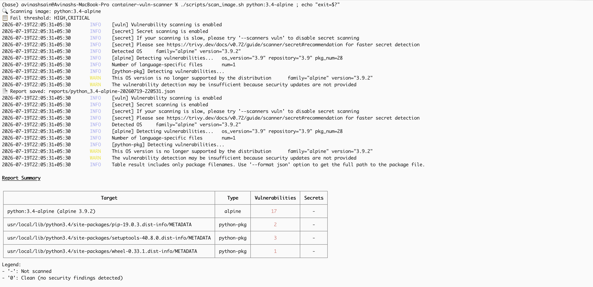
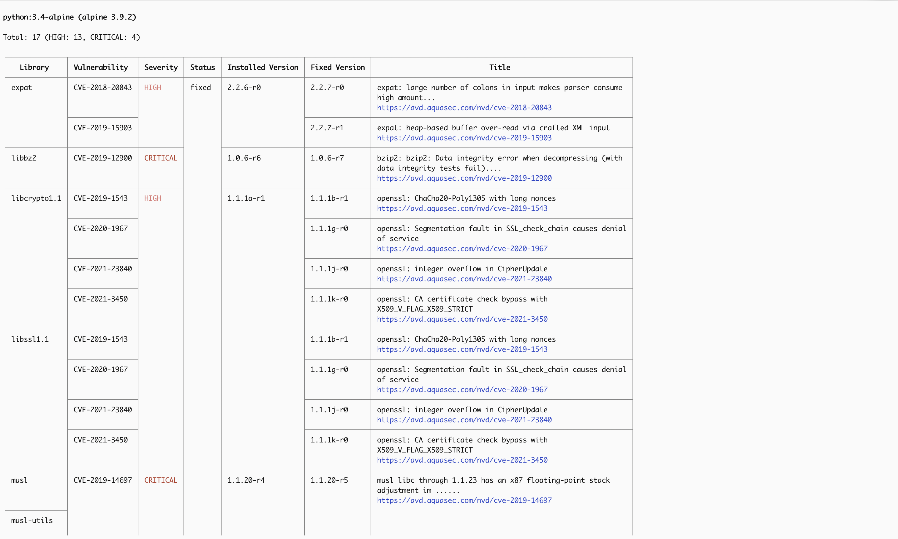
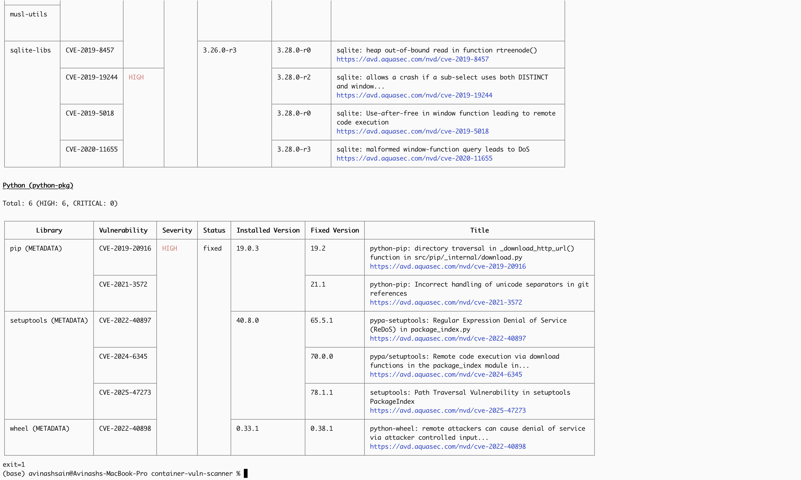
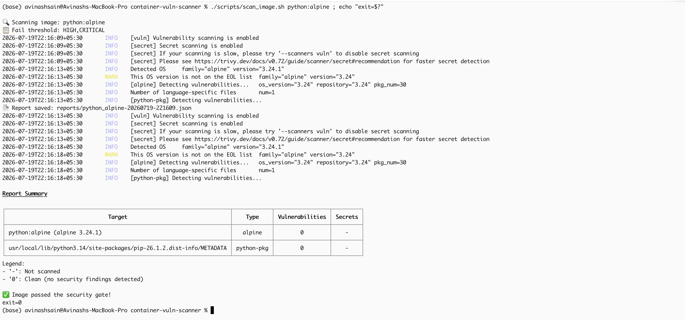
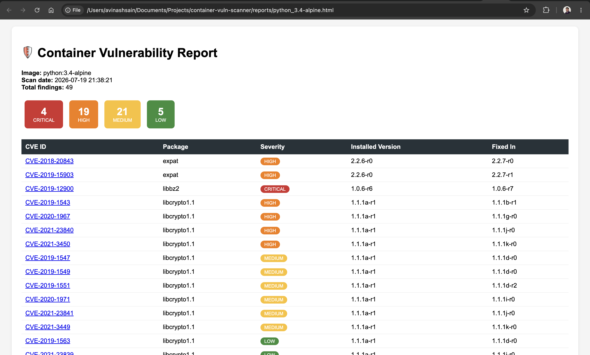
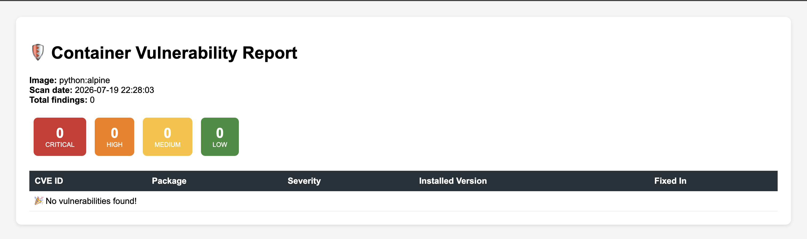
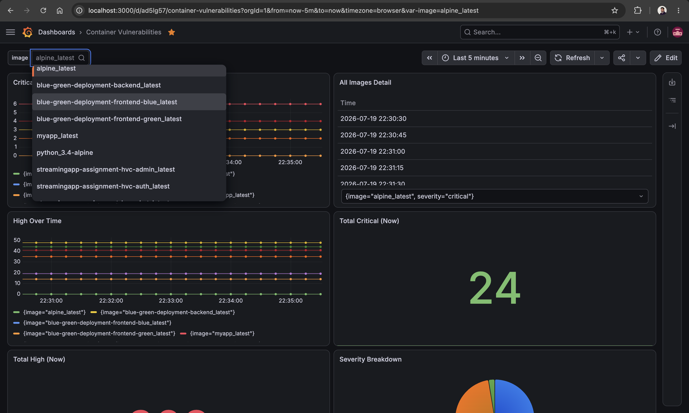
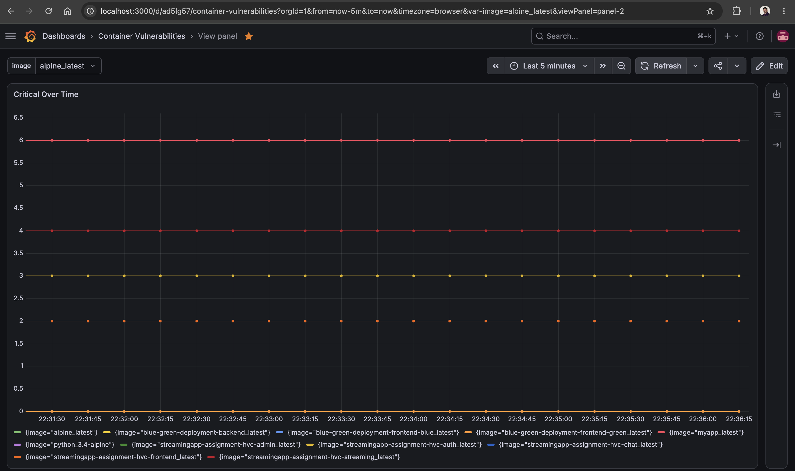

# Usage Guide

How to scan images, read reports, configure thresholds, and manage exceptions.

---

## 1. Scanning an Image

### Basic scan (with security gate)
```bash
./scripts/scan_image.sh <image-name:tag>
```

Examples:
```bash
./scripts/scan_image.sh myapp:latest
./scripts/scan_image.sh python:3.4-alpine          # old image → will FAIL
./scripts/scan_image.sh alpine:latest               # clean image → will PASS
./scripts/scan_image.sh blue-green-deployment-frontend-green:latest
```

What the script does:
1. Saves a **full JSON report** to `reports/<image>-<timestamp>.json`
2. Runs the **security gate**: exits with code `1` if HIGH/CRITICAL vulnerabilities found, `0` if clean

Check the result:
```bash
./scripts/scan_image.sh python:3.4-alpine ; echo "exit=$?"
# exit=1 → BLOCKED (vulnerabilities found)
# exit=0 → PASSED
```







> **Demo tip — same family, different version:** `python:3.4-alpine` (2015-era) FAILS the gate while `python:alpine` (latest) PASSES it. Same base family, only the version differs — a clean demonstration that keeping base images updated is the primary vulnerability fix. Alpine bases also help: with only ~20-30 packages (vs 87 in debian-slim), the attack surface is minimal.

### Understanding scan output columns

| Column | Meaning |
|---|---|
| Library | The vulnerable package inside the image (e.g., openssl) |
| Vulnerability | CVE ID — unique identifier, searchable at https://nvd.nist.gov |
| Severity | LOW / MEDIUM / HIGH / CRITICAL (based on CVSS 0–10 score) |
| Installed Version | Version currently in the image |
| Fixed Version | Version that fixes it ("No fix yet" = vendor hasn't patched) |

---

## 2. Configuring Thresholds

Edit `configs/scanner-config.env`:

```bash
# Which severities block the build (comma-separated)
FAIL_ON_SEVERITY=HIGH,CRITICAL

# Where reports are saved
REPORT_DIR=reports

# Skip vulnerabilities that have no fix available? (true/false)
IGNORE_UNFIXED=false
```

**Common configurations:**

| Team policy | Setting |
|---|---|
| Strict (block everything serious) | `FAIL_ON_SEVERITY=MEDIUM,HIGH,CRITICAL` |
| Standard (recommended) | `FAIL_ON_SEVERITY=HIGH,CRITICAL` |
| Only block fixable issues | `IGNORE_UNFIXED=true` |

> **Design rationale:** `IGNORE_UNFIXED=true` is a legitimate real-world policy — if the vendor hasn't released a fix, blocking the build achieves nothing the developer can act on. Our GitHub Actions gate uses this setting.

---

## 3. Generating Reports

### HTML report (human-readable, styled)
```bash
python3 scripts/generate_report.py reports/scan.json reports/scan.html
```
Open the HTML file in any browser. Features: severity badge counts, color-coded rows, clickable CVE links to the NVD database.





### Quick terminal summary
```bash
python3 scripts/parse_scan.py reports/scan.json
```

---

## 4. Slack Notifications

```bash
export SLACK_WEBHOOK_URL="https://hooks.slack.com/services/..."
python3 notifications/slack_notify.py reports/scan.json
```

Alert levels (chosen automatically from worst finding):
- 🔴 **CRITICAL ALERT** — critical vulnerabilities present
- 🟠 **High severity found**
- 🟢 **Scan clean / low risk**

**Non-blocking design:** if Slack is unreachable or the webhook is invalid, the script prints a warning and exits `0` — the pipeline continues. Scan results are the critical output; alerts are best-effort.

---

## 5. Grafana Dashboard

Open http://localhost:3000 → dashboard **Container Vulnerability Tracker**.

### Pushing metrics after a scan
```bash
python3 scripts/push_metrics.py reports/scan.json
```

### Dashboard panels

| Panel | Shows |
|---|---|
| Critical Over Time | Trend line of critical vulns per image |
| High Over Time | High severity trend |
| Total Critical / High (Now) | Big stat numbers, green=0 / red=1+ |
| Severity Breakdown | Pie chart of all severities |
| Vulns by Image | Bar ranking — riskiest image on top |
| All Images Detail | Table: image × severity exact counts |

### Filters
- **Image dropdown** (top-left): filter all panels to specific image(s) — built with a Grafana query variable on the `image` label
- **Time range picker** (top-right): Last 15 min / 6 hours / 7 days etc.

### Generating trend data (before a demo)
```bash
./scripts/generate_trend_data.sh   # 10 rounds × all images, 60s apart
```




---

## 6. Managing Exceptions (Approved CVEs)

Sometimes a vulnerability is an accepted risk (no fix exists, or the vulnerable code path is unused). Add it to `.trivyignore`:

```
# Accepted by security team on 2026-07-10, review by 2026-10-01
# Reason: vulnerable function not reachable in our code
CVE-2023-12345
```

Rules we follow:
1. **Always** comment WHY and an expiry/review date
2. Also record it in `configs/exceptions.json` (machine-readable, auditable)
3. Run `python3 scripts/check_exceptions.py` periodically — warns when exceptions expire

Verify an exception works:
```bash
echo "CVE-2024-XXXXX" >> .trivyignore
./scripts/scan_image.sh myapp:latest    # that CVE no longer appears
```

---

## 7. Rescanning & Retry

### Change-detection rescan
New CVEs are published daily — yesterday's clean image may fail today.
```bash
python3 scripts/rescan.py
```
Compares current counts to the last run (`reports/last_state.json`) and reports only **changes**. Schedule weekly via cron:
```
0 6 * * 1 python3 /path/to/scripts/rescan.py
```

### Smart retry (for flaky networks)
```bash
./scripts/scan_with_retry.sh myapp:latest
```
Logic:
- Exit `0` (clean) → done ✅
- Exit `1` (vulnerabilities) → **no retry** — this is a real failure 🚫
- Other exit codes (network/DB errors) → retry up to 3 times with 10s delay ⚠️

---

## 8. Running the Full Test Suite

Scans every configured image end-to-end (scan → gate → HTML → Slack → Grafana):

```bash
export SLACK_WEBHOOK_URL="..."   # optional; skipped gracefully if unset
./scripts/run_all_tests.sh
```

Sample summary:
```
  FINAL SUMMARY
════════════════════════════════════════════
  ✅ PASS  alpine:latest
  ❌ FAIL  python:3.4-alpine
  ❌ FAIL  streamingapp-assignment-hvc-auth:latest
  ...
  Total: 11 | Passed gate: 4 | Blocked: 7
```

---

## 9. Real-World Integration Example: Blue-Green Deployment

We integrated the scanner into a blue-green deployment workflow as a **pre-switch security check** — the green environment only receives production traffic after passing the security gate:

```bash
./scripts/pre_switch_check.sh
# ✅ Green is secure — SAFE to switch traffic
# 🚫 Green has HIGH/CRITICAL vulnerabilities — DO NOT switch!
```

This directly fulfills the project's problem statement: *ensuring only secure images are deployed*.