# Blue-Green Deployment — Node.js + MongoDB on Kubernetes

<div align="center">


**A production-style blue-green deployment on local Kubernetes using Minikube**

**Author:** Avinash Sain &nbsp;|&nbsp; **Docker Hub:** [avinashsain65](https://hub.docker.com/u/avinashsain65)

</div>

---

## Table of Contents

- [Overview](#overview)
- [Architecture](#architecture)
- [Project Structure](#project-structure)
- [Tech Stack](#tech-stack)
- [Prerequisites](#prerequisites)
- [Part 1 — Local Deployment](#part-1--local-deployment)
- [Part 2 — Containerisation](#part-2--containerisation)
- [Part 3 — Kubernetes Deployment](#part-3--kubernetes-deployment)
- [Part 4 — Blue-Green Switching](#part-4--blue-green-switching)
- [Challenges & Solutions](#challenges--solutions)
- [Improvements / Future Scope](#improvements--future-scope)

---

## Overview

This project demonstrates a **blue-green deployment strategy** for a full-stack Node.js + MongoDB user registration application, fully containerised with Docker and deployed on **Kubernetes using Minikube**.

### Key Features

- **Blue-Green Deployment** — zero-downtime traffic switching via label selector patching
- **Two Frontend Versions** — Basic UI (Blue) and Enhanced UI (Green)
- **Backend REST API** — Express + MongoDB for user registration
- **Health Probes** — liveness & readiness on every pod
- **Resource Management** — CPU & memory requests/limits on all containers
- **Docker Hub** — all images published at `avinashsain65/*`

### Services

| Service | Port | Kubernetes Type | Docker Hub Image |
|---|---|---|---|
| MongoDB | 27017 | ClusterIP | `mongo:7.0` |
| Backend API | 9000 | ClusterIP + NodePort | `avinashsain65/blue-green-backend:latest` |
| Frontend Blue (Basic) | 3100 | NodePort :30100 | `avinashsain65/blue-green-frontend-blue:latest` |
| Frontend Green (Enhanced) | 3200 | NodePort :30200 | `avinashsain65/blue-green-frontend-green:latest` |
| Frontend Active (Live) | 80 | NodePort :30080 | ← selector-switched |

---

## Architecture

```
                        ┌─────────────────────────────────────────┐
                        │           Kubernetes Cluster             │
                        │                                          │
  User Traffic          │   ┌──────────────────┐                  │
  ──────────────────►   │   │  frontend-active  │ NodePort :30080  │
                        │   │  (blue or green)  │                  │
                        │   └────────┬─────────┘                  │
                        │            │ kubectl patch               │
                        │    ┌───────┴────────┐                   │
                        │    ▼                ▼                   │
                        │ ┌──────────┐  ┌──────────┐             │
                        │ │ frontend │  │ frontend │             │
                        │ │  -blue   │  │  -green  │             │
                        │ │  :3100   │  │  :3200   │             │
                        │ └────┬─────┘  └────┬─────┘             │
                        │      └──────┬───────┘                   │
                        │             ▼                            │
                        │       ┌─────────┐                       │
                        │       │ backend │  :9000                 │
                        │       └────┬────┘                       │
                        │            ▼                            │
                        │       ┌─────────┐                       │
                        │       │ mongodb │  :27017                │
                        │       └─────────┘                       │
                        └─────────────────────────────────────────┘
```

**Blue-Green Switch Flow:**
```
./switch.sh green
  └─► kubectl patch svc frontend-active
        └─► spec.selector.version: blue → green
              └─► All traffic now hits frontend-green pods
                    └─► Rollback: ./switch.sh blue  (< 1 second)
```

---

## Project Structure

```
Blue-green-Deployment/
├── backend/
│   ├── Dockerfile
│   ├── .dockerignore
│   ├── server.js               # Express API, port 9000
│   ├── package.json
│   ├── routes/users.js
│   └── models/user.js
├── frontend-blue/              # Basic UI  (Blue deployment)
│   ├── Dockerfile
│   ├── .dockerignore
│   ├── server.js               # Express static server, port 3100
│   ├── package.json
│   └── public/
│       ├── index.html
│       └── styles.css
├── frontend-green/             # Enhanced UI (Green deployment)
│   ├── Dockerfile
│   ├── .dockerignore
│   ├── server.js               # Express static server, port 3200
│   ├── package.json
│   └── public/
│       ├── index.html
│       ├── app.js
│       └── styles.css
├── k8s/
│   ├── deployments/
│   │   ├── mongodb-deployment.yml
│   │   ├── backend-deployment.yml
│   │   ├── frontend-blue-deployment.yml
│   │   └── frontend-green-deployment.yml
│   ├── namespace/
│   │   └── namespace.yml
│   └── services/
│       ├── mongodb-service.yml
│       ├── backend-service.yml
│       ├── frontend-blue-service.yml
│       ├── frontend-green-service.yml
│       └── frontend-active-service.yml   ← live traffic entry point
├── docker-compose.yml
├── switch.sh                             # Blue-green switcher script
└── README.md
```

---

## Tech Stack

| Tool | Purpose | Version |
|---|---|---|
| Node.js | Runtime for backend & frontends | 20 LTS |
| Express.js | HTTP framework | ^4.18 |
| MongoDB | User data persistence | 7.0 |
| Mongoose | MongoDB ODM | ^8.0 |
| Docker | Containerisation | Latest |
| Minikube | Local Kubernetes cluster | v1.30+ |
| kubectl | Kubernetes CLI | v1.27+ |

---

## Prerequisites

| Tool | Install Link | Check Command |
|---|---|---|
| Git | https://git-scm.com | `git --version` |
| Node.js | https://nodejs.org | `node --version` |
| Docker | https://docs.docker.com/get-docker/ | `docker --version` |
| Minikube | https://minikube.sigs.k8s.io/docs/start/ | `minikube version` |
| kubectl | https://kubernetes.io/docs/tasks/tools/ | `kubectl version --client` |

```bash
# Verify all tools
git --version && node --version && docker --version && minikube version && kubectl version --client
```

---

## Part 1 — Local Deployment

### Step 1 — Clone & Install

```bash
git clone https://github.com/mohanDevOps-arch/Blue-green-Deployment.git
cd Blue-green-Deployment

cd backend       && npm install && cd ..
cd frontend-blue && npm install && cd ..
cd frontend-green && npm install && cd ..
```

### Step 2 — Start MongoDB

```bash
# Option A — Docker (recommended)
docker run -d --name mongodb -p 27017:27017 mongo:7.0

# Option B — local mongod
sudo systemctl start mongod
```

### Step 3 — Configure Environment

```bash
echo "PORT=9000
MONGO_URI=mongodb://localhost:27017/userdb" > backend/.env

echo "PORT=3100" > frontend-blue/.env
echo "PORT=3200" > frontend-green/.env
```

### Step 4 — Start All Services

```bash
# Terminal 1 — Backend
cd backend && npm start
# ✓ Backend server running on port 9000

# Terminal 2 — Blue Frontend
cd frontend-blue && npm start
# ✓ Basic frontend server running on port 3100

# Terminal 3 — Green Frontend
cd frontend-green && npm start
# ✓ Green frontend server running on port 3200
```

### Step 5 — Verify

```bash
# Backend health check
curl http://localhost:9000/health
# {"status":"ok","message":"Backend API is running"}

# Register a test user
curl -s -X POST http://localhost:9000/api/users \
  -H "Content-Type: application/json" \
  -d '{"name":"Alice","surname":"Smith","dob":"1990-01-15","job":"Engineer",
       "place":"London","interests":["coding"],"knownLanguages":["JavaScript"],
       "registeredFrom":"basic"}'

# Check counts
curl http://localhost:9000/api/users/count
```

| Service | URL |
|---|---|
| Backend API | http://localhost:9000/health |
| Blue (Basic) Frontend | http://localhost:3100 |
| Green (Enhanced) Frontend | http://localhost:3200 |

> **Screenshot:** Local services running — all three terminals active, browser showing both frontends

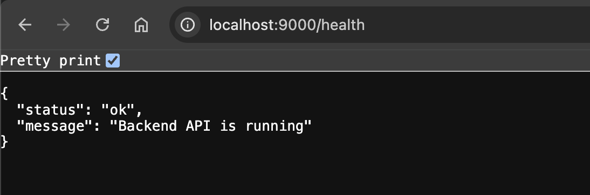
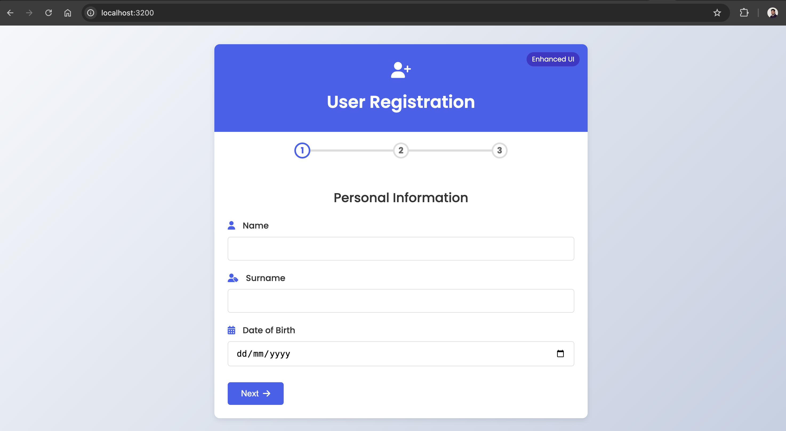
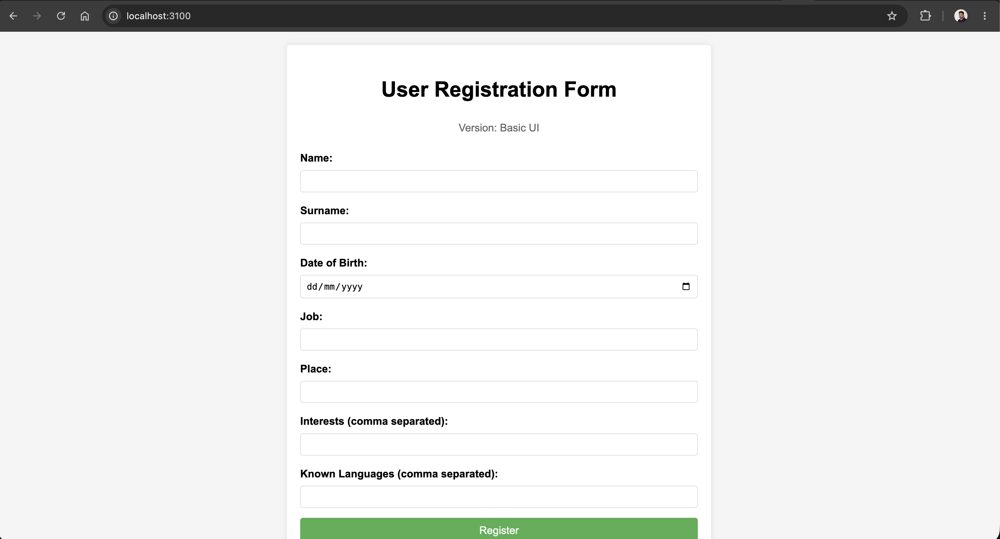
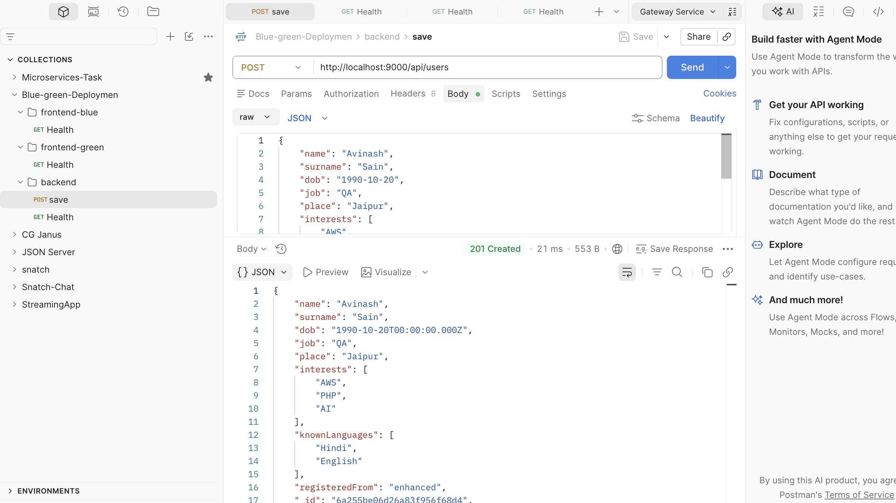

---

## Part 2 — Containerisation

### Dockerfile Design — Multi-Stage Build

All three Dockerfiles use a **multi-stage build** pattern:

```dockerfile
# Stage 1: Install dependencies
FROM node:20-alpine AS builder
WORKDIR /app
COPY package*.json ./
RUN npm install --omit=dev

# Stage 2: Lean runtime image
FROM node:20-alpine
RUN addgroup -S appgroup && adduser -S appuser -G appgroup
WORKDIR /app
COPY --from=builder /app/node_modules ./node_modules
COPY . .
RUN chown -R appuser:appgroup /app
USER appuser
EXPOSE <port>
HEALTHCHECK ...
CMD ["node", "server.js"]
```

**Benefits:** ~60% smaller final image, non-root user, health checks built-in.

### Build Images

```bash
docker build -t avinashsain65/blue-green-backend:latest        ./backend
docker build -t avinashsain65/blue-green-frontend-blue:latest  ./frontend-blue
docker build -t avinashsain65/blue-green-frontend-green:latest ./frontend-green

# Verify
docker images | grep blue-green
```

### Run with Docker Compose

```bash
docker compose up -d

# Check all containers healthy
docker compose ps
```

```bash
# Access
# http://localhost:9000/health   → Backend API
# http://localhost:3100          → Blue Frontend
# http://localhost:3200          → Green Frontend
```

> **Screenshot:** `docker compose ps` — all 4 containers Up and healthy

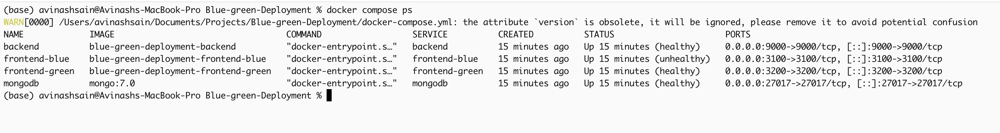

### Push to Docker Hub

```bash
docker login

docker push avinashsain65/blue-green-backend:latest
docker push avinashsain65/blue-green-frontend-blue:latest
docker push avinashsain65/blue-green-frontend-green:latest
```

> **Screenshot:** Docker Hub repository showing all three images

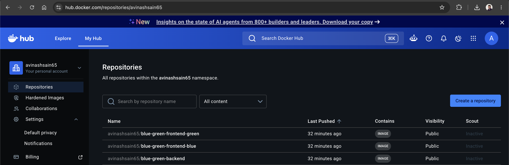

---

## Part 3 — Kubernetes Deployment

### Step 1 — Start Minikube

```bash
minikube start --driver=docker --cpus=2 --memory=4096
minikube status
```

### Step 2 — Apply Manifests

```bash
# Apply in order
kubectl apply -f k8s/namespace/
kubectl apply -f k8s/deployments/
kubectl apply -f k8s/services/
```

### Step 3 — Verify Pods

```bash
kubectl get pods -n blue-green
```

Expected output:
```
NAME                             READY   STATUS    RESTARTS   AGE
backend-84d59f9fcf-bk7rg         1/1     Running   0          44s
backend-84d59f9fcf-kx8ns         1/1     Running   0          44s
frontend-blue-58fd7c6c5c-g4jvg   1/1     Running   0          44s
frontend-blue-58fd7c6c5c-wsjhz   1/1     Running   0          44s
frontend-green-c44dbbc9d-4w5dq   1/1     Running   0          44s
frontend-green-c44dbbc9d-db6tk   1/1     Running   0          44s
mongodb-5c648c7cd5-w25x7         1/1     Running   0          44s
```

> **Screenshot:** All 7 pods `1/1 Running`

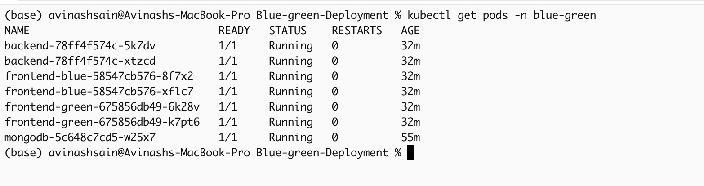

### Step 4 — Verify Services

```bash
kubectl get svc -n blue-green
```

> **Screenshot:** `kubectl get svc -n blue-green`

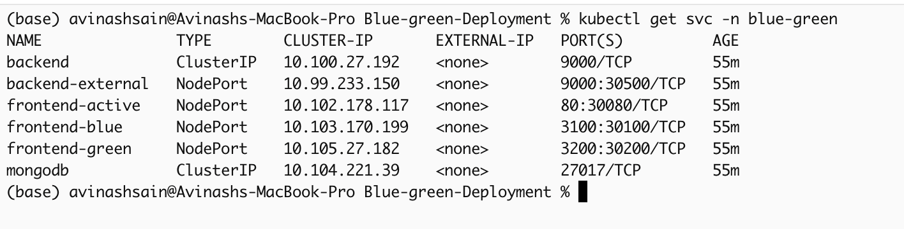

### Step 5 — Access the Application

```bash
# Get live frontend URL
minikube service frontend-active -n blue-green --url

# Expose backend for testing
kubectl port-forward svc/backend -n blue-green 9000:9000
```

### Health Checks Configured

Every Deployment uses both probes:

```yaml
livenessProbe:
  httpGet:
    path: /health
    port: <container-port>
  initialDelaySeconds: 20
  periodSeconds: 15

readinessProbe:
  httpGet:
    path: /health
    port: <container-port>
  initialDelaySeconds: 10
  periodSeconds: 10
```

> **Screenshot:** Both frontends accessible in browser via Minikube URL

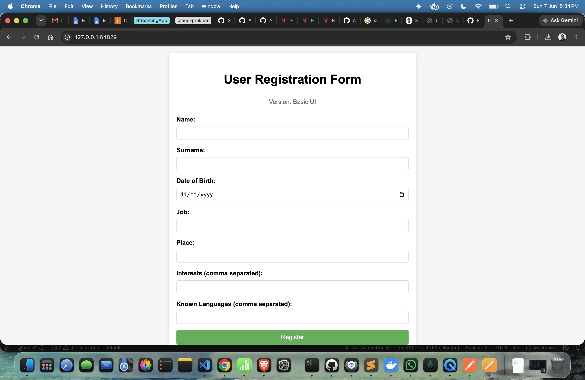

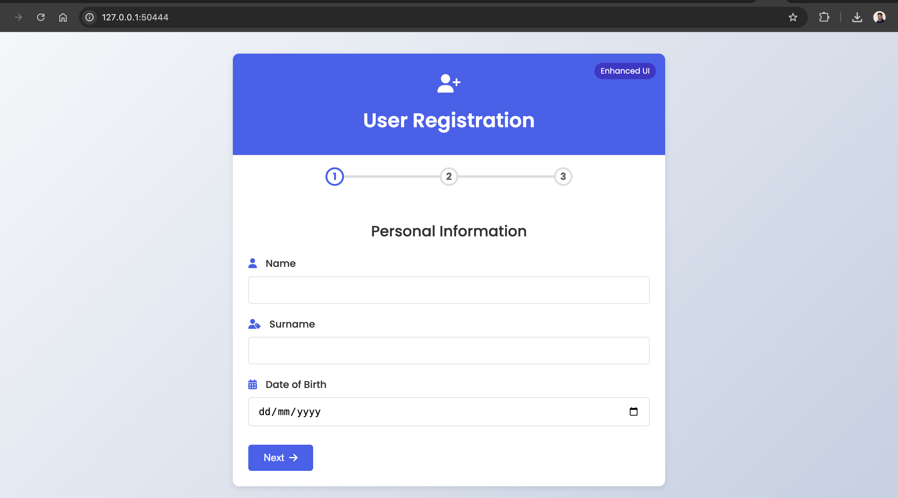

---

## Part 4 — Blue-Green Switching

### Strategy

The blue-green strategy uses **label-selector patching** on a single shared `frontend-active` Service:

| | Blue | Green |
|---|---|---|
| **UI Version** | Basic | Enhanced |
| **Port** | 3100 | 3200 |
| **Label** | `version: blue` | `version: green` |
| **Status** | Initial live | Staged / standby |

Switching is done by patching `spec.selector.version` on `frontend-active` — no pod restarts, no downtime, instant rollback.

### Using the Switch Script

```bash
chmod +x switch.sh

# Check current live version
./switch.sh status

# Cut over to Enhanced UI (Green)
./switch.sh green

# Roll back to Basic UI (Blue) instantly
./switch.sh blue
```

### Manual kubectl Commands

```bash
# ── Switch to Green ───────────────────────────────────────────────
kubectl patch svc frontend-active -n blue-green \
  --type=merge \
  -p '{"spec":{"selector":{"app":"frontend","version":"green"},
       "ports":[{"protocol":"TCP","port":80,"targetPort":3200,"nodePort":30080}]}}'

# ── Switch back to Blue ───────────────────────────────────────────
kubectl patch svc frontend-active -n blue-green \
  --type=merge \
  -p '{"spec":{"selector":{"app":"frontend","version":"blue"},
       "ports":[{"protocol":"TCP","port":80,"targetPort":3100,"nodePort":30080}]}}'

# ── Verify which version is live ──────────────────────────────────
kubectl get svc frontend-active -n blue-green \
  -o jsonpath='{.spec.selector.version}'
```

### Pre-Switch Checklist

```bash
# 1. Confirm green is fully ready
kubectl rollout status deployment/frontend-green -n blue-green

# 2. Smoke-test green directly (no live traffic impact)
minikube service frontend-green -n blue-green

# 3. Switch live traffic
./switch.sh green

# 4. Monitor logs
kubectl logs -n blue-green -l version=green -f --tail=50

# 5. Roll back instantly if needed
./switch.sh blue
```

> **Screenshot:** Before switch — `frontend-active` selector showing `blue`

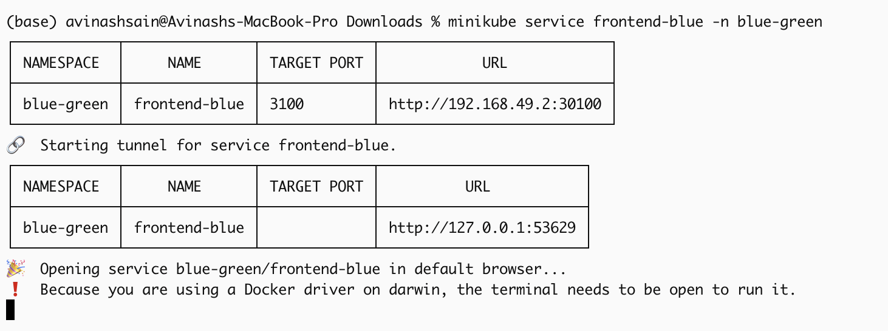

> **Screenshot:** After `./switch.sh green` — selector showing `green`, browser showing Enhanced UI

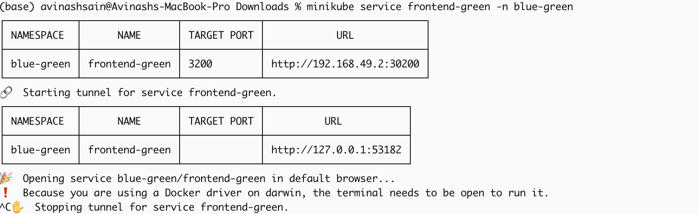

> **Screenshot:** Both deployments running simultaneously during switch

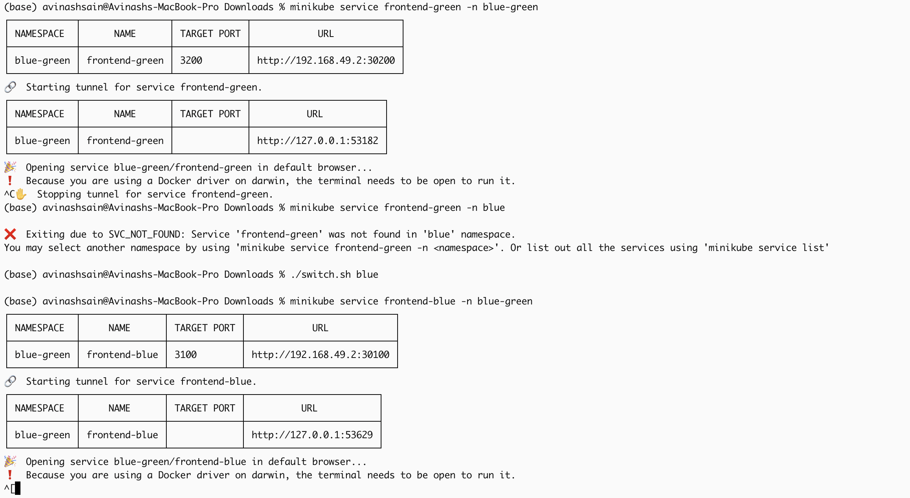

---

## Challenges & Solutions

### Challenge 1 — `npm ci` fails (no package-lock.json)
**Problem:** `npm ci` requires a lockfile; the repo has none.  
**Solution:** Replaced `npm ci` with `npm install --omit=dev` in all Dockerfiles.

### Challenge 2 — Port conflicts on host machine
**Problem:** Port 5000 (AirPlay), 6000 (browser-blocked unsafe port), 8080 (Jenkins) all in use.  
**Solution:** Settled on port **9000** for the backend — safe for browsers and free on the host.

### Challenge 3 — Backend probes hitting wrong port
**Problem:** Kubernetes liveness/readiness probes were hitting port 6000 instead of the container port, causing `CrashLoopBackOff`.  
**Solution:** Deleted the old deployment and reapplied the corrected manifest with `kubectl delete deployment backend -n blue-green && kubectl apply -f k8s/deployments/backend-deployment.yml`.

### Challenge 4 — Old Docker image cached in running pods
**Problem:** Frontend still called `localhost:5000` despite source file showing `9000` — old image still running.  
**Solution:** Forced full rebuild with `docker compose build --no-cache`, then `kubectl rollout restart`.

### Challenge 5 — Port mismatch during blue-green switch
**Problem:** `frontend-active` hardcodes `targetPort` — switching version also requires changing the target port atomically.  
**Solution:** `kubectl patch --type=merge` updates both `selector.version` and `ports[0].targetPort` in a single API call.

### Challenge 6 — Image visibility in Minikube
**Problem:** `imagePullBackOff` — locally built images not visible inside Minikube VM.  
**Solution:** `eval $(minikube docker-env)` redirects Docker CLI to Minikube's daemon. All manifests use `imagePullPolicy: Always` with Docker Hub images.

---

## Improvements / Future Scope

| Feature | Description |
|---|---|
| **Automated Switch Pipeline** | GitHub Actions triggers blue-green switch on new image push |
| **Horizontal Pod Autoscaling** | Scale frontend pods based on CPU/memory load |
| **ConfigMaps & Secrets** | Externalise all env vars and MongoDB credentials safely |
| **Persistent Volumes** | StatefulSet for MongoDB with proper PVC backup strategy |
| **Ingress Controller** | NGINX Ingress for path-based routing and TLS termination |
| **Centralised Logging** | ELK Stack for log aggregation across all pods |
| **Service Mesh** | Istio for observability, mTLS and traffic splitting |
| **Cloud Deployment** | AWS EKS / GCP GKE / Azure AKS for production |
| **Smoke Test Automation** | Run automated tests against green before switching active service |

---

## Quick Reference

```bash
# ── Local ──────────────────────────────────────────
docker compose up -d

# ── Kubernetes ─────────────────────────────────────
kubectl apply -f k8s/namespace/
kubectl apply -f k8s/deployments/
kubectl apply -f k8s/services/

kubectl get pods -n blue-green
kubectl get svc  -n blue-green

# Expose backend
kubectl port-forward svc/backend -n blue-green 9000:9000

# ── Blue-Green Switch ───────────────────────────────
./switch.sh status   # check current live version
./switch.sh green    # cut over to Enhanced UI
./switch.sh blue     # roll back to Basic UI

# ── Teardown ────────────────────────────────────────
kubectl delete namespace blue-green
docker compose down -v
minikube stop
```

---

## License

This project is licensed under the **MIT License**.

---

<div align="center">

**Avinash Sain**

[](https://hub.docker.com/u/avinashsain65)

</div>
